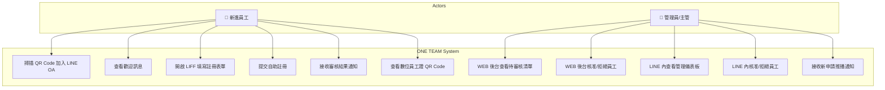
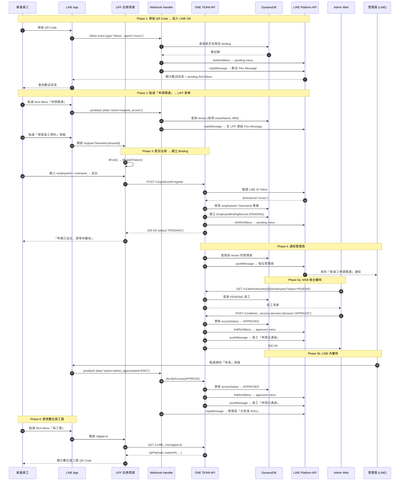
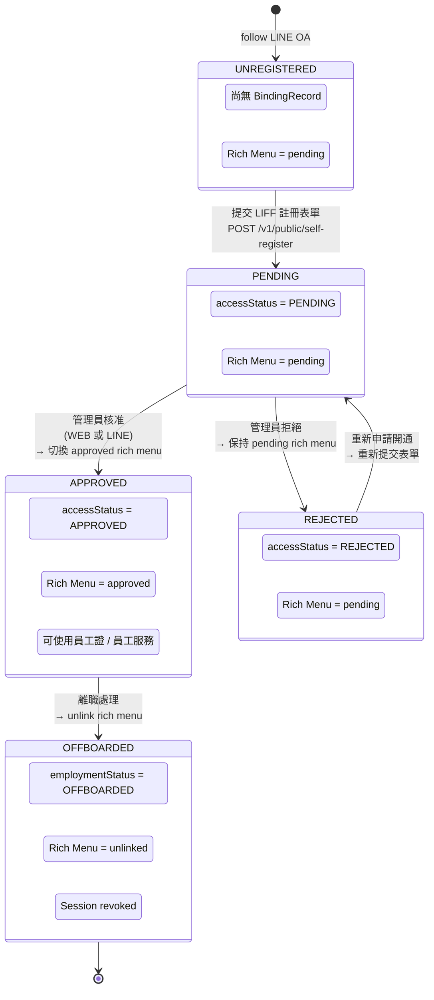
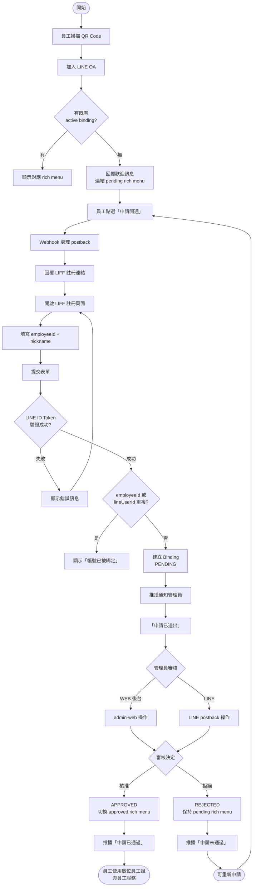

# ONE TEAM 員工自助註冊上線流程 — User Story + UML 設計

## Context

重新定義整個員工從新報到到使用數位員工證的完整流程。取代原有的「邀請碼 + 批次 email 邀請」流程，改為更簡潔的「掃 QR Code → 自助註冊 → 主管審核」模式。

**設計決策**（已與使用者確認）：
- 員工資料輸入：**LIFF 網頁表單**（非 LINE 聊天對話）
- 審核方式：**WEB 後台 + LINE 雙軌**並行
- 舊邀請碼流程：**移除**，僅保留新的自助註冊流程

---

## 1. User Stories（使用者故事）

### US-1: 新進員工 — 加入 LINE OA 並申請開通

**作為**新進員工，
**我想要**透過掃描 QR Code 加入公司的 LINE 官方帳號，並填寫員工資料申請開通，
**以便**我能快速完成身份綁定，使用數位員工證與員工服務。

**驗收標準**:
1. 員工掃描 QR Code 後成功加入 LINE OA（觸發 follow event）
2. 系統自動回覆歡迎 Flex Message，含公司名稱與操作指引
3. 員工點選 Rich Menu「申請開通」後，收到含 LIFF 連結的回覆訊息
4. 點選連結開啟 LIFF 註冊表單，要求輸入：員工編號 + 暱稱
5. LIFF 透過 LINE LIFF SDK 取得 ID Token，連同表單資料送至 API
6. 系統驗證 LINE ID Token → 建立 EmployeeBindingRecord（accessStatus = PENDING）
7. 系統連結 pending rich menu
8. 員工看到「申請已送出，請等待管理員審核」確認畫面

### US-2: 新進員工 — 收到審核結果通知

**作為**新進員工，
**我想要**在管理員審核完成後立即收到 LINE 推播通知，
**以便**我知道是否已通過並能開始使用員工服務。

**驗收標準**:
1. 核准時：收到「✅ 存取申請已通過」Flex Message，Rich Menu 切換為 approved 版本
2. 拒絕時：收到「❌ 存取申請未通過」Flex Message，引導聯絡管理員
3. 被拒絕的員工可重新點選「申請開通」重新提交

### US-3: 管理員 — WEB 後台審核員工

**作為**管理員/主管，
**我想要**在 WEB 管理後台查看待審核的員工清單，並進行核准或拒絕，
**以便**我能有效管理員工的存取權限。

**驗收標準**:
1. 管理員登入 admin-web 後台（JWT 驗證）
2. 顯示待審核員工清單：員工編號、暱稱、申請時間
3. 可點選「核准」或「拒絕」按鈕
4. 操作完成後清單即時更新，系統自動推播通知給員工

### US-4: 管理員 — LINE 內審核員工

**作為**擁有管理權限的員工（主管），
**我想要**直接在 LINE 聊天室中審核待開通的員工，
**以便**不需要登入後台就能快速處理。

**驗收標準**:
1. 管理員從 approved rich menu →「員工服務」→「管理後台」→ 統計儀表板
2. 點選「查看待審核」→ carousel 顯示待審核員工卡片（顯示暱稱）
3. 每張卡片有「核准」「拒絕」按鈕，點選後立即執行
4. 有新註冊申請時，管理員收到 LINE 推播通知（含快速核准/拒絕按鈕）

### US-5: 已核准員工 — 使用數位員工證

**作為**已通過審核的員工，
**我想要**從 Rich Menu 快速開啟數位員工證 QR Code，
**以便**我能在需要時出示員工身份。

**驗收標準**:
1. Approved rich menu 左側按鈕「員工證」直接開啟 LIFF digital-id 頁面
2. 頁面顯示 QR Code，定期自動更新（25 秒）
3. QR Code 可被掃描器驗證

---

## 2. UML 圖表（Mermaid 語法）

### 2a. Use Case Diagram



### 2b. Sequence Diagram — 完整流程



### 2c. State Machine Diagram — Employee Binding 生命週期



### 2d. Activity Diagram — 整體流程含決策點



---

## 3. API 變更

### 3.1 新增端點

#### POST /v1/public/self-register（替代舊的 bind/start + bind/complete）

```
POST /v1/public/self-register
Content-Type: application/json

{
  "tenantId": "tenant_abc",
  "lineIdToken": "eyJ...",
  "employeeId": "E001",
  "nickname": "小明"
}
```

處理流程：
1. `LineAuthClient.validateIdToken()` 驗證 lineIdToken → 提取 lineUserId
2. 檢查 employeeId / lineUserId 是否已被綁定（409 if duplicate）
3. 建立 EmployeeBindingRecord: `{ accessStatus: PENDING, nickname }`
4. linkRichMenu → pending menu
5. 查詢 tenant 管理員 → pushMessage 通知
6. Response: `{ tenantId, employeeId, accessStatus: "PENDING", registeredAt }`

Zod schema:
```typescript
const selfRegisterSchema = z.object({
  tenantId: z.string().min(1),
  lineIdToken: z.string().min(1),
  employeeId: z.string().min(1).max(50),
  nickname: z.string().min(1).max(50)
});
```

#### GET /v1/admin/tenants/{tenantId}/employees

```
GET /v1/admin/tenants/{tenantId}/employees?status=PENDING&limit=50
Authorization: Bearer {adminJwt}
```

Response:
```json
{
  "employees": [
    {
      "employeeId": "E001",
      "nickname": "小明",
      "accessStatus": "PENDING",
      "boundAt": "2026-02-28T10:00:00.000Z",
      "accessRequestedAt": "2026-02-28T10:00:00.000Z"
    }
  ]
}
```

### 3.2 移除的端點（舊 invitation flow）

| 端點 | 說明 |
|------|------|
| `POST /v1/admin/tenants/{tid}/invites` | 建立邀請連結 |
| `POST /v1/admin/tenants/{tid}/invites/batch-email` | 批次 email 邀請 |
| `POST /v1/admin/tenants/{tid}/invites/batch-jobs/{jid}/dispatch` | 發送批次邀請 |
| `POST /v1/public/bind/start` | 開始綁定（需 invitation token） |
| `POST /v1/public/bind/complete` | 完成綁定（需 binding code） |
| `POST /v1/liff/tenants/{tid}/me/invites` | 員工自建邀請 |

### 3.3 保留的端點

- `POST /v1/admin/tenants/{tid}/employees/{eid}/access-decision` — WEB 後台審核用
- `GET /v1/liff/tenants/{tid}/me/digital-id` — 數位員工證
- `POST /v1/line/webhook/{tid}` — LINE webhook

---

## 4. Rich Menu + Webhook 變更

### 4.1 「申請開通」按鈕行為

Rich menu 跨 tenant 共用同一 channel，無法在 URI 中嵌入 tenantId。

**方案**：保持 postback `action=request_access`，webhook handler（知道 tenantId）回覆含 LIFF 連結的 Flex Message：

```
LIFF URL: https://liff.line.me/{liffId}/register?tenantId={tenantId}
```

### 4.2 新增 `request_access` postback handler

```typescript
// WebhookEventService.handlePostback() 新增 case
case 'request_access':
  await this.handleRequestAccess(tenantId, event);
  return;
```

`handleRequestAccess` 邏輯：
1. 查詢 tenant → 取得 tenantName, liffId
2. 檢查 lineUserId 是否已有 binding：
   - 有 PENDING binding → 回覆「申請正在審核中」
   - 有 APPROVED binding → 回覆「您已開通」
   - 無 binding → 回覆 LIFF 註冊連結 Flex Message
3. 被 REJECTED 的也可重新填表

### 4.3 更新 Follow 事件歡迎訊息

```
handleFollow() 更新：
1. 查詢 tenant → 取得 tenantName
2. 檢查是否已有 binding
3. 無 binding → linkRichMenu(pending) + 回覆歡迎 Flex Message
4. 有 binding → 根據 accessStatus 連結對應 rich menu
```

---

## 5. 通知流程

| 事件 | 對象 | 管道 | 訊息 |
|------|------|------|------|
| 員工加入 LINE OA | 員工 | LINE reply | 歡迎 Flex Message |
| 員工點選「申請開通」 | 員工 | LINE reply | LIFF 註冊連結 |
| 員工提交註冊 | 管理員(s) | LINE push | 新申請通知（含核准/拒絕按鈕） |
| 管理員核准 | 員工 | LINE push | 「✅ 申請已通過」 |
| 管理員拒絕 | 員工 | LINE push | 「❌ 申請未通過」 |

管理員判定：`accessStatus === 'APPROVED'` 且 `canInvite === true || canRemove === true`

---

## 6. Domain Model 變更

`EmployeeBindingRecord` 新增欄位：
```typescript
nickname?: string;  // 員工暱稱
```

---

## 7. 前端變更

### LIFF Web — 新增 /register 頁面
```
apps/liff-web/src/registration/
  registration-form.tsx    // 表單元件
  use-registration.ts      // Hook: liff.init + API call
  types.ts
```

### Admin Web — 新增員工管理頁面
```
apps/admin-web/src/employee-management/
  employee-list.tsx        // 員工清單
  employee-card.tsx        // 員工卡片（含核准/拒絕按鈕）
  use-employee-list.ts     // Hook
  api-client.ts
  types.ts
```

---

## 8. 實作順序

| # | 工作項目 | 關鍵檔案 |
|---|----------|----------|
| 1 | Domain model: 新增 nickname 欄位 | `apps/api/src/domain/invitation-binding.ts` |
| 2 | 新增 POST /v1/public/self-register API | `apps/api/src/lambda.ts`, new service |
| 3 | 新增 GET /admin/.../employees API | `apps/api/src/lambda.ts` |
| 4 | 更新 webhook: follow 歡迎訊息 + request_access handler | `apps/api/src/services/webhook-event-service.ts` |
| 5 | 新增 Flex Message templates | `apps/api/src/line/flex-message-templates.ts` |
| 6 | 在 decideAccess 加入員工推播通知 | `apps/api/src/services/employee-access-governance-service.ts` |
| 7 | 在 self-register 加入管理員推播通知 | Step 2 的 service |
| 8 | LIFF Web: 註冊表單頁面 | `apps/liff-web/src/registration/` |
| 9 | Admin Web: 員工管理頁面 | `apps/admin-web/src/employee-management/` |
| 10 | 移除舊 invitation flow | `apps/api/src/lambda.ts` |
| 11 | 更新 Rich Menu script | `scripts/update-richmenu.mjs` |

---

## 9. 驗證方式

1. `pnpm build && pnpm test` — 確保所有測試通過
2. 部署後：掃 QR Code → 確認收到歡迎訊息 + pending rich menu
3. 點選「申請開通」→ 確認收到 LIFF 連結
4. 填寫表單送出 → 確認管理員收到推播
5. 管理員核准 → 確認員工收到通知 + rich menu 切換
6. 員工點選「員工證」→ 確認 QR Code 顯示正常
